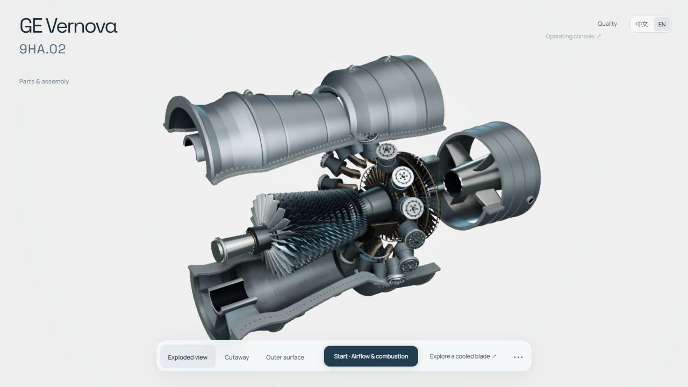
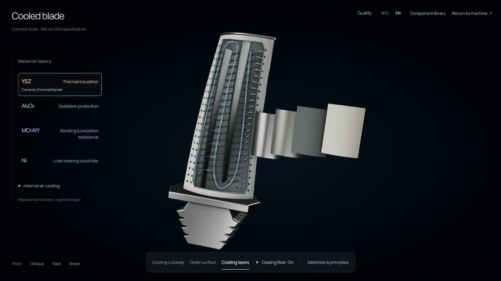

# Turbine Explorer

A composable gas turbine study, built with procedural Three.js geometry.
Open the casing, separate the assemblies, and look inside a cooled turbine blade.

[Open the interactive model](https://labs.jizhang.io/gas-turbine/?lang=en) · [中文](https://labs.jizhang.io/gas-turbine/?lang=zh)

[](https://labs.jizhang.io/gas-turbine/?lang=en&chapter=2&service=major&quality=high&background=white)

Separate the casing and assemblies. Drag to orbit, scroll to zoom, then inspect a component.

[](https://labs.jizhang.io/gas-turbine/?lang=en&inspect=blade&quality=high)

Go inside a cooled blade. Hover or focus a material label to highlight its layer; click to keep it selected.
Both images are screenshots of the running model, not manufacturer renders.

## Explore

- Cutaway, enclosed and exploded assembly views.
- Component selection, extraction, orbit and close inspection.
- A cooled blade with internal passages, cooling-flow animation and a representative coating stack.
- Rotor motion, airflow, combustion cues and quiet, opt-in synthesized sound.
- English and Chinese, adjustable render quality and household-energy equivalents with visible assumptions.
- Live backgrounds: navy blueprint, white paper with blue drafting lines, white studio and graphite studio.

This is an independent educational visualization inspired by public GE Vernova 9HA references.
It is not affiliated with or endorsed by GE Vernova, not manufacturer CAD, not CFD,
and not a maintenance or operating procedure. Geometry, removal paths and flow effects are illustrative.
The cooled blade is a generic teaching model, not a disclosed 9HA.02 blade design.

## Run

Requires Node.js 22.18 or newer and a WebGL-capable browser.

```sh
npm ci
npm run dev
```

The home page opens the English cutaway exhibition. Drag to orbit, scroll to zoom,
choose the exploded view to separate assemblies, and open the cooled-blade study.
Sound starts only after a user gesture. The compact **Quality** panel is available on the machine
and every component view. Balanced, Fine and Showcase share one saved setting, with the current
render resolution shown in pixels. Desktop starts in Fine; small screens start in Balanced.
Use `?quality=ultra` for a presentation link. Supersampling sharpens the same geometry;
the longest render edge is capped at 4096 pixels to bound GPU memory use.
Choose **Quality → Background** to change the backdrop without changing the metal materials,
camera or render quality. The setting is shared with component close-ups and saved locally.
Deep links accept `background=blueprint`, `paper`, `white` or `graphite`.

```sh
npm test
npm run build
npm run preview
```

The output is a static `dist/` directory. No backend, server-side GPU, API key or database is needed.

## Structure

| File | Purpose |
| --- | --- |
| `src/turbine.ts` | Whole-machine assembly, geometry and component hierarchy |
| `src/sectioned-case.ts` | Complementary casing sections |
| `src/service-state.ts` | Exploded-view poses and motion interlocks |
| `src/component-inspector.ts` | Component extraction and independent inspection |
| `src/blade-study.ts` | Cooled-blade geometry and coating study |
| `src/exhibition.ts` | Exhibition controls and walkthrough |
| `src/audio.ts` | Procedural Web Audio sound design |
| `src/energy.ts` | Energy-equivalence assumptions and calculation |

## Deploy

Deploy `dist/` to any static host for a standalone installation.
For Ji Zhang Labs, run `npm run build:labs`: this produces `dist-labs/` with a Labs index
and the application at `/gas-turbine/`. For Cloudflare Pages Git integration, select this repository,
use build command `npm test && npm run build:labs`, output directory `dist-labs`, and Node.js 22.18 or newer.
Attach your chosen subdomain in the project's Custom domains settings before creating its DNS record.
Never put Cloudflare credentials in source files or frontend environment variables.

The Labs publishing target is `https://labs.jizhang.io/gas-turbine/`. Update canonical URLs,
Open Graph / Twitter metadata and `hosting/sitemap.xml` when deploying to another domain.
Social-preview tags are in the initial HTML so crawlers do not need to execute WebGL or JavaScript.

## Sources and licensing

Original code and procedural models are MIT-licensed. See [LICENSE](LICENSE) and
[THIRD_PARTY_NOTICES.md](THIRD_PARTY_NOTICES.md) for third-party assets and dependencies.
Reference photographs, manufacturer renders, downloaded videos and source-document copies
are intentionally not distributed here. [Technical sources and limitations](docs/SOURCES.md).

GE Vernova and product names identify the subject, not the publisher of this project.
The MIT license does not grant rights to third-party trademarks or source imagery.
