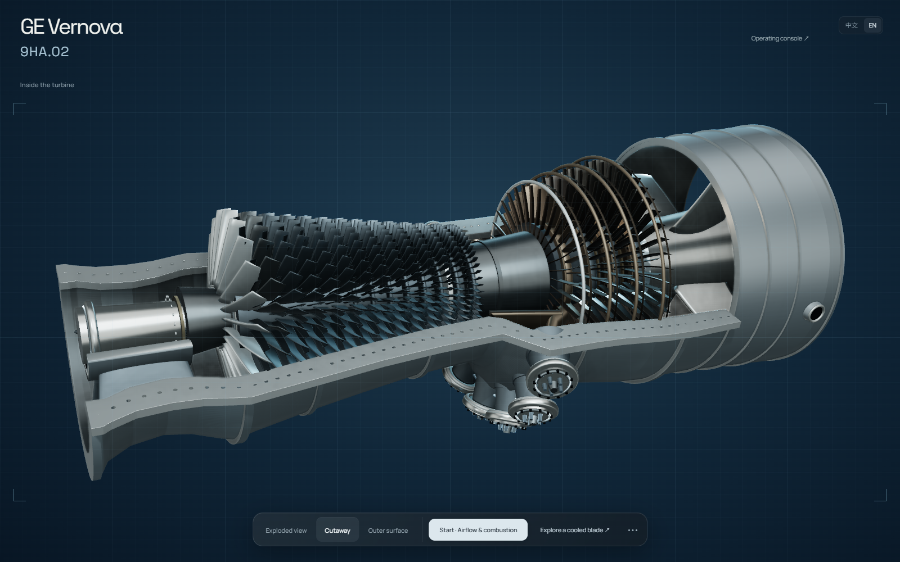

# Turbine Explorer

A composable gas turbine study, built with procedural Three.js geometry.
Open the casing, separate the assemblies, and look inside a cooled turbine blade.



## Explore

- Cutaway, enclosed and exploded assembly views.
- Component selection, extraction, orbit and close inspection.
- A cooled blade with internal passages, cooling-flow animation and a representative coating stack.
- Rotor motion, airflow, combustion cues and quiet, opt-in synthesized sound.
- English and Chinese, adjustable render quality and household-energy equivalents with visible assumptions.

This is an independent educational visualization inspired by public GE Vernova 9HA references.
It is not affiliated with or endorsed by GE Vernova, not manufacturer CAD, not CFD,
and not a maintenance or operating procedure. Geometry, removal paths and flow effects are illustrative.
The cooled blade is a generic teaching model, not a disclosed 9HA.02 blade design.

## Run

Requires Node.js 22.18 or newer and a WebGL-capable browser.

```sh
npm ci
npm run dev
```

The home page opens the English cutaway exhibition. Drag to orbit, scroll to zoom,
choose the exploded view to separate assemblies, and open the cooled-blade study.
Sound starts only after a user gesture. Quality can be changed in the settings menu.

```sh
npm test
npm run build
npm run preview
```

The output is a static `dist/` directory. No backend, server-side GPU, API key or database is needed.

## Structure

| File | Purpose |
| --- | --- |
| `src/turbine.ts` | Whole-machine assembly, geometry and component hierarchy |
| `src/sectioned-case.ts` | Complementary casing sections |
| `src/service-state.ts` | Exploded-view poses and motion interlocks |
| `src/component-inspector.ts` | Component extraction and independent inspection |
| `src/blade-study.ts` | Cooled-blade geometry and coating study |
| `src/exhibition.ts` | Exhibition controls and walkthrough |
| `src/audio.ts` | Procedural Web Audio sound design |
| `src/energy.ts` | Energy-equivalence assumptions and calculation |

## Deploy

Deploy `dist/` to any static host. For Cloudflare Pages Git integration, select this repository,
use build command `npm run build`, output directory `dist`, and Node.js 22.18 or newer.
Attach your chosen subdomain in the project's Custom domains settings before creating its DNS record.
Never put Cloudflare credentials in source files or frontend environment variables.

## Sources and licensing

Original code and procedural models are MIT-licensed. See [LICENSE](LICENSE) and
[THIRD_PARTY_NOTICES.md](THIRD_PARTY_NOTICES.md) for third-party assets and dependencies.
Reference photographs, manufacturer renders, downloaded videos and source-document copies
are intentionally not distributed here. [Technical sources and limitations](docs/SOURCES.md).

GE Vernova and product names identify the subject, not the publisher of this project.
The MIT license does not grant rights to third-party trademarks or source imagery.
